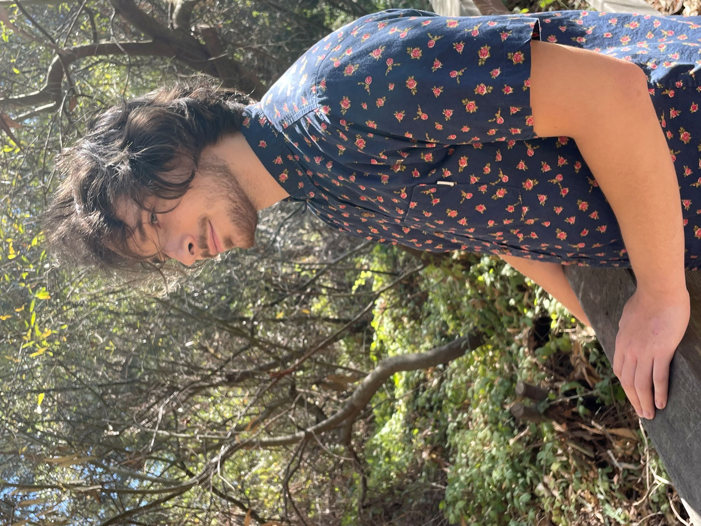

# About me
Born 1998, in Moscow, I moved to the States at two years old. My favorite pastimes as a child were legos and video games, which eventually transformed into computing and electronics. I went on to study Computer Engineering with a focus in Digital Hardware at UCSC. After my graduation in 2021 I went to work as a design verification engineer at Esperanto Technologies, where I honed my skills and prepared to pursue a graduate degree. In 2022 I was accepted back into UCSC. This time for the MS program with the CSE department, under the tutelage of Professor Jose Renau. 

## Current work
[Dromajo - MASC/UCSC](https://github.com/masc-ucsc/dromajo)
As supply chain issues rattle the world of computing, now more than ever do engineers need chip designs that do more but are (physically) less. My research aims to help CPU designers meet both of these goals, specifically through my RISC-V Vector Processing Unit (VPU) co-simulation environment. An extension to the open source tool Dromajo, my model of the VPU is meant to provide designers with a “golden standard” as to how their design should function to be RISC-V compliant. Functionally, it will run its software model in parallel with a hooked RTL design, and will inform the user if any discrepancies are detected during runtime of RISC-V binaries.

### Why a VPU?
The modern demand for highly parallelized computation is becoming increasingly popular, as machine learning and artificial intelligence models have come into the mainstream. The VPU is a simple, and highly configurable solution to these problems. This is because at design time, the engineers decide how large to make the word size as well as the vector register size. Then during run-time, it can dynamically switch between various element sizes, allowing a great deal of optimization for wildly different workloads.

## Past work
[Dromajo - Chips Alliance](https://github.com/chipsalliance/dromajo)
My first major assignment at Esperanto Technologies was the patching and improvement of their contribution to the RISC-V ecosystem as a part of the Chips Alliance. This software is Dromajo, and working on it forced me to read the RISC-V official specification manual over and over again, until I understood the semantics perfectly. Since then I have done some small RTL development as well as helped with Linux bring-up for one of the company's major designs.

### Why RISC-V?
My time at Esperanto Technologies greatly helped develop my engineering skills. What it also did was expose me to the highly collaborative and tightly-knit RISC-V community. By open sourcing many parts of the design process, from RTL to compiler, the RISC-V ecosystem is constantly evolving on a global scale. This lowers the bar of entry for newcomers to the CPU design community, as well as encourages the old guard to share (and argue about) their latest and greatest ideas.

## Past Research
[HDLGen](https://github.com/masc-ucsc/livehd_regression/tree/main/HDLgen)
The first bit of research work I did was in Hardware Compiler Validation. The compiler in question is [LiveHD](https://github.com/masc-ucsc/livehd), a multi language compiler framework, meant to genericize and speed up the hardware development workflow. My role in this project was to validate the correctness of compilation through the random generation of semantically equivalent RTL files. The languages that my generator supports are Verilog, Chisel, and the in-house language Pyrope. My project, HDLGen, allows the user to create thousands of wildly varying circuit structures and gives them the options to set size, complexity, as well as sets of logic to include/uninclude from the Verilog, Chisel, and Pyrope syntax. 

## Ancient History
[SlugSense Design](https://github.com/markzakharov/SlugSense)
The most fun I had during my time as an undergraduate at UCSC was doing collaborative projects. One was my senior capstone project, Slugsense. This was an interesting challenge as it put me with six other students I had never met before, in a purely virtual setting, trying to build and program an embedded system for those with visual disabilities. Powered by a small, rechargeable battery, Slugsense was a sonar detector that had an adjustable range and haptic feedback system. The host was run on an Arduino nano board and was meant to be held in a small plastic chassis, which is to be worn on the user's arm. The intensity of vibration is determined by the distance between it and the closest physical object. Any configuration was set through a GUI, driven by another Arduino nano, connected over bluetooth. The schematics, code, tested data, as well as 3d print instructions are all open-sourced and available on github.

### When I'm not glued to my computer chair
#### Santa Cruz Live Music Scene
I have been an active music performer in the Santa Cruz area since before the pandemic. Moving away from home and coming to UCSC was a stressful experience for me, so I decided to teach myself how to play bass guitar as a form of therapy. Being a lifelong trained classical musician, it was easy enough to be enjoyable but also challenging enough to force me to concentrate on. Since then I have also learned how to play the six-string guitar and have performed with three different groups, both on the streets of Santa Cruz, and at live venues. Now, six years later, it still gets me out of the house and onto the stage.

#### Pet African Dwarf Frogs
After getting dumped with unwanted fish by an old roommate, I purchased a nice little three gallon tank to house the little swimmers. Years went by and the fish all lived their full life spans. Once the tank was empty I wanted some more exciting denizens for the glass castle. I decided to try my hand at raising an African Dwarf Frog named Freddy. Weeks went by and he eventually started singing at night. After some research I found out these frogs are highly social and poor Freddy was singing to find his friends. I went to the pet store later that week to pick up a couple of friends for him, Cosmo and Wanda. He has been thrilled since, but still continues to sing, probably for his own enjoyment. 
